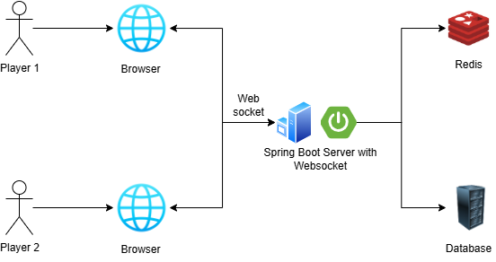

# Multiplayer Tic Tac Toe

A real-time multiplayer Tic Tac Toe game built with Java and Spring Boot. The application leverages WebSocket technology for gameplay between two players, with Redis for active game states and PostgreSQL for persistent data.

## How to Play

This require 2 different session/browser/people to play.<br>
Create a room, copy your game ID and wait for other player. <br>
After 2nd player joined, play the game.

## Prerequisites

- Java 21
- Redis server
- PostgreSQL database

or

- Java 21
- Docker and Docker Compose

## Quick Start using Docker
```bash
git clone https://github.com/frhn9/tictactoe.git
docker-compose up -d
./gradlew bootRun
```

## Game Architecture


